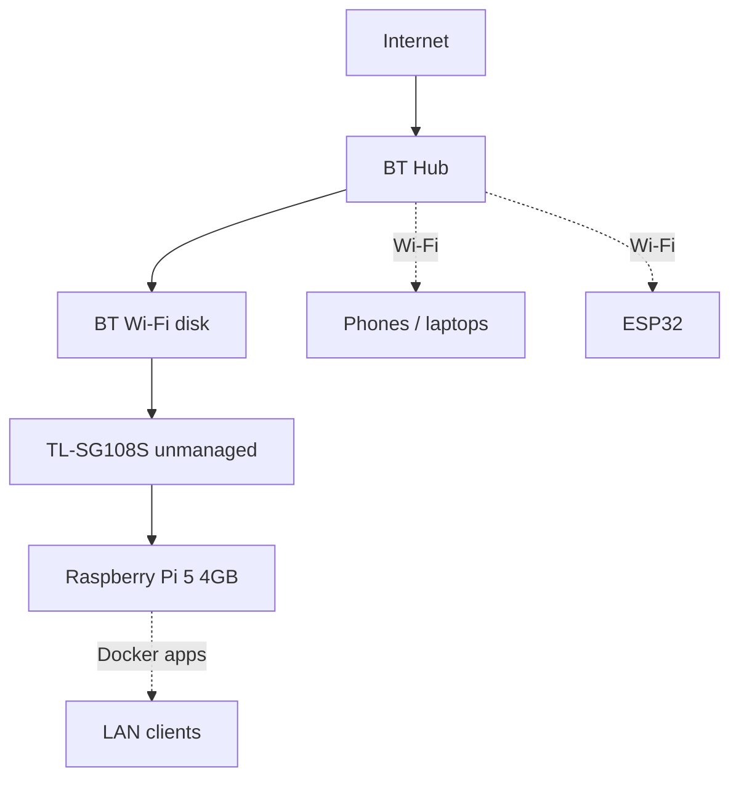

# Home network

Last confirmed topology (fill the blanks the day you bring the lab back).

## Logical diagram

Physical order of Ethernet, as last written:

**BT Hub → BT Wi-Fi disk → TL-SG108S → Raspberry Pi 5**

If you later plug the switch **directly** into a Hub LAN port (disk only for wireless), update this file the same day. Loops (Hub and disk both feeding the switch) will make the LAN sad.

## Addressing (private only)

| Role | Hostname | MAC (truncate) | IPv4 | Notes |
|------|----------|----------------|------|--------|
| BT Hub | | | _e.g. 192.168.1.254_ | DHCP/NAT/Wi-Fi. Do not commit admin URL + password. |
| BT Wi-Fi disk | | | | Extender / mesh node |
| TL-SG108S | — | — | none | Unmanaged. No web UI, no VLANs, no LACP. |
| Raspberry Pi 5 | | | | Reserve this DHCP lease on the Hub |
| ESP32 | | | | DHCP on Wi-Fi |
| Laptop (admin) | | | | |

Typical BT Hub LAN is `192.168.1.0/24` with the Hub at `.254`, but **yours may differ**. Copy from `ip r` and the Hub device list. Never commit the public WAN IP.

## Switch: TL-SG108S

- 8× gigabit, unmanaged.
- Every port is the same VLAN (the whole home LAN).
- You **cannot** practise 802.1Q, trunks, or ACLs on this box. For that, use Packet Tracer / GNS3 / Linux VLANs on the Pi — see the IT-path lab notes in Jarvis when that folder is on `main`.
- Dedicate **port 1** as uplink (Hub/disk) and **port 8** as Pi so you can see link lights without guessing.

## Services you may still have on the Pi

Installed **2 Jun 2025** (see [changelog.md](changelog.md)). Confirm ports after `docker ps`:

| Service | Default port | Why it exists |
|---------|--------------|----------------|
| Docker Engine | — | Container runtime |
| Jellyfin | 8096 | Media UI |
| qBittorrent | (check compose) | Downloads — keep it legal; do not document trackers here |
| Prowlarr / Radarr / Sonarr | (check compose) | *arr stack if you still run it |

Add rows when you add Pi-hole, Home Assistant, Jarvis APIs, etc. **Do not** commit API keys or torrent site configs.

## Constraints (honest)

- The Hub is the router. The Pi is a server on the LAN, not the edge firewall.
- 4 GB RAM: Jellyfin transcode + *arr + desktop Jarvis will hurt. Direct-play and one heavy service at a time.
- Guest Wi-Fi / IoT isolation: BT Hub features vary. ESP32 on the same LAN as the Pi is simplest; a separate SSID is a later hardening step.
- Remote access from the internet: skip it until you know what you are exposing. Prefer Tailscale/WireGuard later over Hub port-forward of Docker.

## Screenshot / git rules

- Blur serials, public IP, Wi-Fi key, Hub admin.
- Show: this topology, `ip a` / `ip r`, switch link lights, `docker ps`.

Pi Ethernet: 192.168.1.150
Pi Wi-Fi: 192.168.1.160
SSH: jt@192.168.1.150  or  jt@raspberrypi.local
